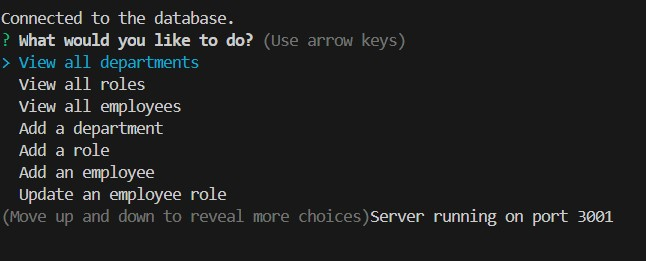
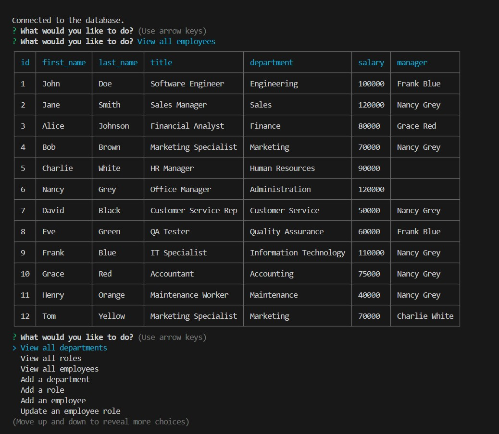

  

# Employee-Tracker

## Description
This employee tracker was created to make it so that a business owner can easily view and manage all of the departments, roles, and employees in their company. It allows the user to bring up a table of each of these as well as add on to each of them. It also allows the user to update the employee role should it change.

## Table of Contents
- [Installation](#installation)
- [Usage](#usage)
- [License](#license)
- [Contributing](#contributing)
- [Tests](#tests)
- [Questions](#questions)

## Installation
This uses node, npm, and PostgreSQL. Make sure to do an npm install to get access to all of the necessary node modules. Also be aware that the environment variables saved to the .env file are not included. You will need to add your own .env file and add the appropriate information.

## Usage
To use simply start the program by typing npm start in the terminal. You will then be presented with a list of options. 

You can choose to view existing tables which include the department table, the roles table, and the employees table. 

You can also choose to add a department, a role, or an employee as well as update an employee's role. If you select any of these options you will be presented with a series of prompts to enter your information. When you are all finished just click exit!

  ## License
    MIT
    
  https://opensource.org/licenses/MIT

## Contributing
At this time no further contributions are needed.

## Tests
Below is a link to a video of the program in action! 

<video controls src="Employee-Tracker-Example-Video.mp4" title="Title"></video>

## Questions
GitHub: [pauletters](https://github.com/pauletters)
Email: pauletters87@gmail.com
